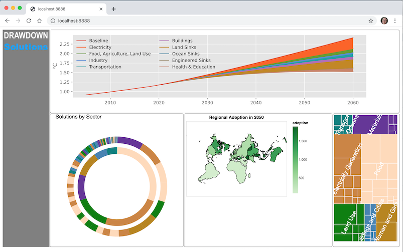

# Project Drawdown Solution Explorer
[Project Drawdown](https://www.drawdown.org/) is the most comprehensive plan yet published for how to solve Global Warming. Project Drawdown entered the climate conversation with the [publication of the 2017 book](https://www.drawdown.org/the-book), and continues its mission to inspire and communicate solutions.

This repository hosts development of a user interface for interaction with the results of the different Drawdown solutions. The intention is to create an implementation which will allow us to broaden the use of the climate solution models to policymakers, business leaders, and other decisionmakers and interested parties.

---

## Getting started

You will need [Git](https://git-scm.com/book/en/v2/Getting-Started-Installing-Git) and [Python 3](https://docs.python.org/3/using/index.html) installed.

Get a copy of this source code:

```sh
$ git clone https://github.com/ProjectDrawdown/explorer.git
$ cd explorer
```

We recommend using pipenv for a virtual environment, then start the Tornado web server:

```sh
$ pipenv shell
(explorer) $ python server.py
```

In a browser, go to http://localhost:8888/



---

## License
The python code for the model engine is licensed under the GNU General Public license and subject to the license terms in the LICENSE file found in the top-level directory of this distribution and at [https://github.com/ProjectDrawdown/explorer](https://github.com/ProjectDrawdown/explorer). No part of this Project, including this file, may be copied, modified, propagated, or distributed except according to the terms contained in the LICENSE file.

---

## Contact

Denton Gentry (dgentry@carboncaptu.re) is currently the technical point of contact for this project.
